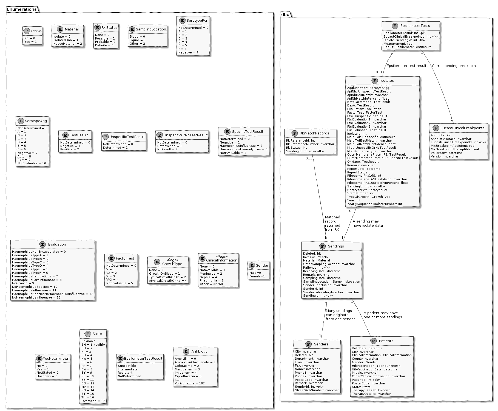
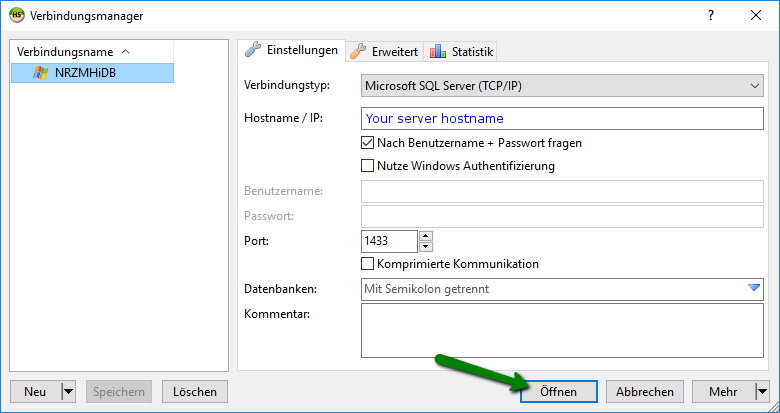
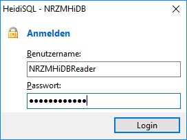
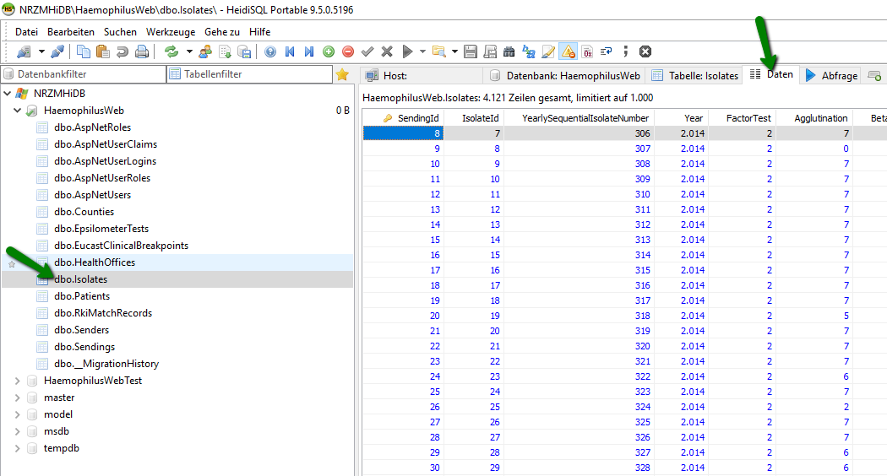
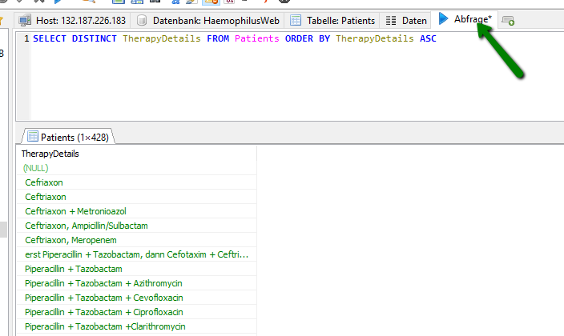

# NRZMHi Database documentation

## Entity diagram

The following diagram shows all entities related to core laboratory data.
Some additional entities like user, roles, ... are not included.



### How to update the diagram

The code for this diagram is written in [PlantUML](http://plantuml.com/). See file [EntityDiagram.uml](EntityDiagram.uml).
It was mostly created using a stored procedure. The procedure code can be found in [PlantUMLDiagram.sql](PlantUMLDiagram.sql).

Call the procedure as follows to create the PlantUML code for a number of tables:

``` SQL
Declare @ThePlantUMLCode Varchar(max)
execute CreatePlantUMLCode @ObjectsToShow='dbo.Senders dbo.Sendings dbo.Patients dbo.Isolates dbo.EpsilometerTests dbo.EucastClinicalBreakpoints dbo.RkiMatchRecords',
        @MyPlantUMLStatement=@ThePlantUMLCode output
select @ThePlantUMLCode
```

The resulting code needs some manual editing afterwards
* Relace three spaces by newline character
* Manually add some missing newlines for each table declaration
* Edit relationships (see comment at the end of PlantUML code)
* Add enumerations (see comment at the end of PlantUML code)

## Readonly database connection

There exists a specific user in the database which is allowed to read the data. This can be useful for data analytics
carried out by people who know how to work with SQL databases.

Use the [HeidiSQL](https://www.heidisql.com/) (or any other MS SQL client of your choice) to access the database.
 
| | |
|-|-|
| Username    | NRZMHiDBReader                  |
| Password    | *Password set on user creation* |
| Hostname    | *Your server hostname*          |

Der Benutzer hat keine Rechte Daten zu bearbeiten oder zu löschen.

### How to connect using HeidiSQL

Create a new Microsoft SQL Server connection using your server hostname and click on `Open`:



Enter username and password:



Select a table on the left and click on data tab to show the table content:



Use the query tab to execute custom SQL scripts:



Further information on HeidiSQL can be found in the [online documentation](https://www.heidisql.com/help.php)

