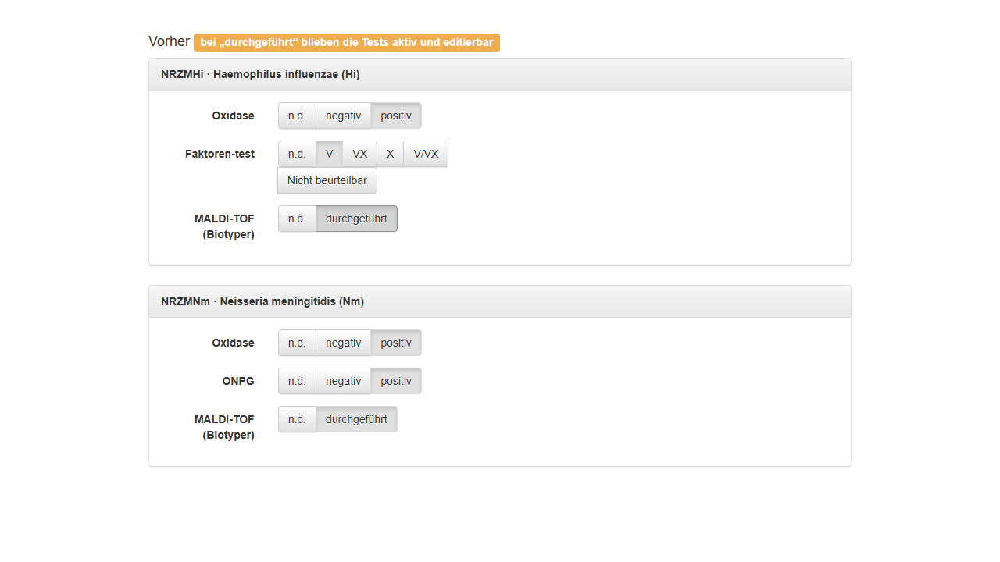
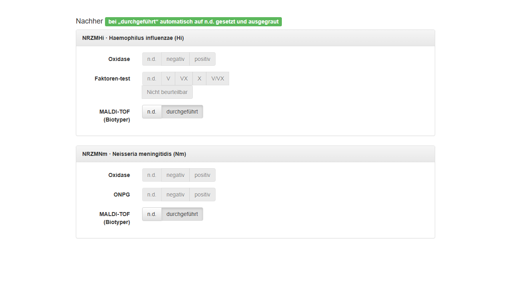

# MALDI-TOF (Biotyper) „durchgeführt“ – Vorher / Nachher

Diese Screenshots dokumentieren das Verhalten der Isolat-Bearbeitungsmasken
(Hi und Nm), wenn **MALDI-TOF (Biotyper)** auf **durchgeführt** gesetzt wird.

## Vorher

Bei „durchgeführt“ blieben Oxidase/ONPG (Nm) bzw. Oxidase/Faktoren-test (Hi)
aktiv und editierbar:

## Nachher

Bei „durchgeführt“ werden Oxidase/ONPG (Nm) bzw. Oxidase/Faktoren-test (Hi)
automatisch auf **n.d.** gesetzt und ausgegraut:

